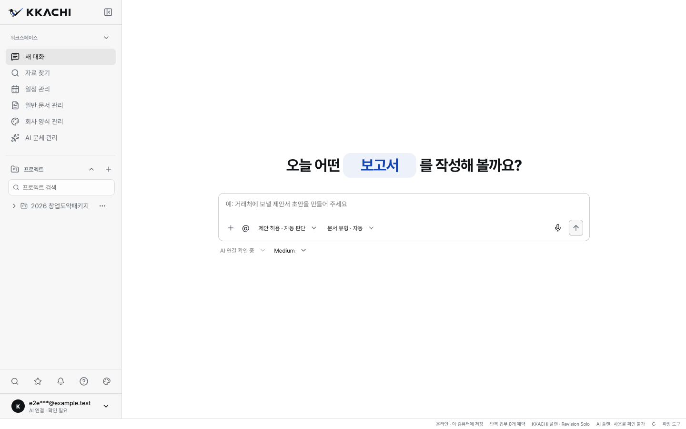
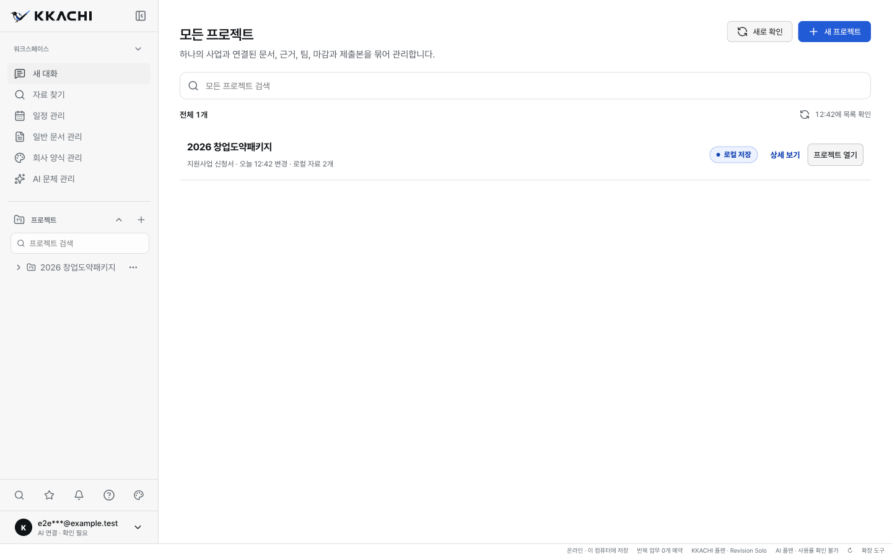
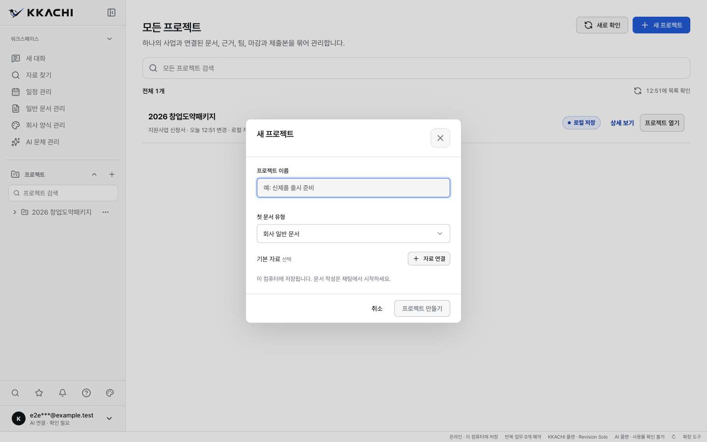
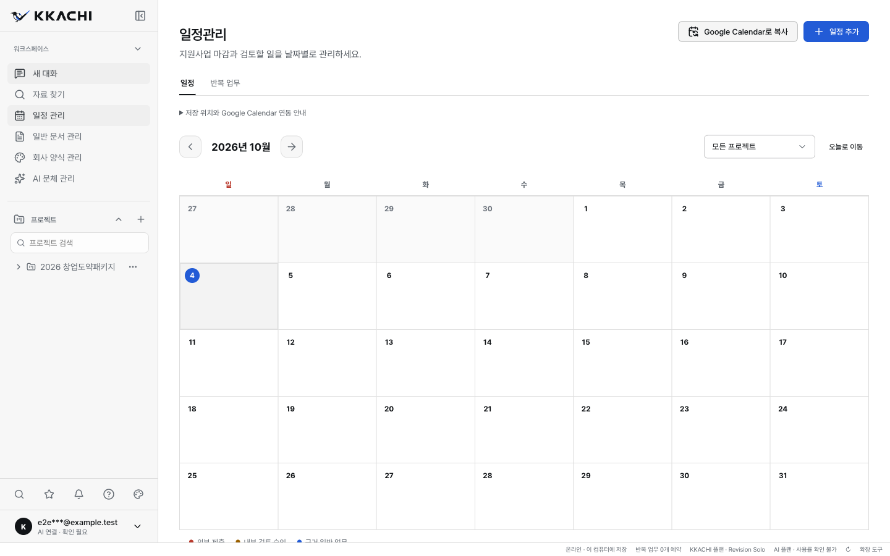

<p align="center">
  <a href="#설치">설치</a> ·
  <a href="#서비스-화면">서비스 화면</a> ·
  
</p>

<h1 align="center">KKACHI · 까치</h1>

<p align="center">
  <strong>아이디어를 기회로, 자료를 문서로.</strong><br />
  한국의 업무 환경을 위한 로컬 중심 AI 문서 작업공간
</p>

<p align="center">
  
  
  
  
</p>

<p align="center">
  <a href="#주요-기능">주요 기능</a> ·
  <a href="#작업-흐름">작업 흐름</a> ·
  <a href="#데이터와-ai-실행">데이터 보호</a> ·
  <a href="#개발-시작하기">개발 시작하기</a> ·
  <a href="#문서">문서</a>
</p>

---

## 소개

KKACHI는 자료 수집, AI 초안 작성, 변경 검토, 문서 저장을 하나의 데스크톱 작업공간으로 연결합니다. 지원사업 신청서부터 제안서, 회사소개서, 투자용 IR까지 한국어 업무 문서를 목적에 맞게 준비합니다.

자료와 문서 이력은 로컬에서 관리하고, AI의 제안은 검토와 승인 과정을 거쳐 반영합니다. 작성 결과뿐 아니라 **어떤 자료를 사용했고, 무엇을 승인했으며, 어느 버전으로 제출했는지**를 함께 관리하는 것이 핵심입니다.

> **현재 상태: 비공개 베타 준비** · 실제 데스크톱 앱이 구현되어 있습니다. 서명·공증과 문서 출력 검증이 완료된 설치 파일은 별도의 공개 다운로드 저장소에 배포합니다. 현재 설치 파일은 아직 발행하지 않았습니다.

## 설치

**[KKACHI 다운로드 및 사용 안내](https://github.com/djfksjd/kkachi-releases)** · [릴리스 목록](https://github.com/djfksjd/kkachi-releases/releases) · [Homebrew 배포 저장소](https://github.com/djfksjd/homebrew-kkachi)

| 플랫폼                | 설치 형식         | 현재 상태                      |
| :-------------------- | :---------------- | :----------------------------- |
| macOS · Apple Silicon | DMG · Homebrew    | 서명·공증 및 출력 검증 준비 중 |
| macOS · Intel         | DMG · Homebrew    | 서명·공증 및 출력 검증 준비 중 |
| Windows · x64         | EXE 설치 프로그램 | 서명 및 출력 검증 준비 중      |

첫 검증된 릴리스와 Cask가 등록되면 아래 명령으로 설치할 수 있습니다. **현재는 설치 패키지가 없어 실행할 수 없습니다.**

```bash
brew install --cask djfksjd/kkachi/kkachi
```

수동 다운로드와 명령어 설치는 [설치·배포 안내](docs/INSTALLATION.md)에 정리했습니다. 소스 코드 저장소는 비공개로 유지하고, 설치 파일과 사용 안내만 공개합니다.

## 서비스 화면

아래는 **실제 Electron 앱을 캡처한 화면**입니다. 별도의 예시 계정과 내장 데모 자료를 사용했으며, 실제 고객 문서나 계정 정보는 포함하지 않았습니다.

### 새 대화에서 업무 시작

요청과 자료를 입력하고 사용할 AI 모델과 도구를 선택합니다.



### 프로젝트를 한눈에 관리

프로젝트 이름, 문서 종류, 최근 변경일과 자료 수를 함께 확인합니다. 검색으로 좁히고 상세 정보나 작업공간을 바로 엽니다.



<table>
  <tr>
    <td width="50%"><strong>목적에 맞는 프로젝트 만들기</strong><br />문서 종류와 시작 자료를 정합니다.</td>
    <td width="50%"><strong>일정과 마감 관리</strong><br />프로젝트와 연결된 로컬 업무 일정을 관리합니다.</td>
  </tr>
  <tr>
    <td></td>
    <td></td>
  </tr>
</table>

## 주요 기능

| 기능                   | 하는 일                                                                                                               |
| :--------------------- | :-------------------------------------------------------------------------------------------------------------------- |
| **목적별 문서 작성**   | 지원사업 신청서, 소상공인 정책자금, 제안·입찰 문서, 특허 초안, 회사소개서, 일반 회사 문서, 투자용 IR의 작성 기준 제공 |
| **자료와 근거 연결**   | 로컬 자료와 승인된 한국 공식 API를 활용해 문서 작성에 필요한 근거 관리                                                |
| **AI 제안 검토**       | 구조화된 결과 검증, 명시적 동의, 품질 확인을 거쳐 선택한 변경 반영                                                    |
| **버전과 제출본 관리** | 변경 이력 보존, 이전 버전 복원, 오래된 버전에 대한 변경 차단, 제출본 명세 관리                                        |
| **투자용 IR**          | 기준 사업 문서에서 IR을 구성하고 승인 절차를 거쳐 편집 가능한 로컬 PPTX 생성                                          |
| **일정과 알림**        | 암호화된 로컬 저장소에서 업무와 알림 관리, 홈 D-Day 및 알림 패널 연결                                                 |
| **선택적 협업**        | 역할·초대·제안·댓글·승인 이력 관리와 사용자 소유 동기화 폴더를 통한 암호화 리비전 공유                                |

문서 종류와 출력 형식은 별도의 지원 범위입니다. PDF·DOCX·PPTX·HWPX 출력에는 각각의 검증 계약이 있으며, 모든 문서가 모든 형식으로 출력된다는 의미는 아닙니다.

## 작업 흐름

**자료 연결 → 초안 요청 → 제안 검토 → 승인 반영 → 로컬 저장·내보내기**

1. **목적과 자료를 정합니다.** 작성할 문서, 사용할 근거, 원하는 결과를 명확히 합니다.
2. **AI에게 초안을 요청합니다.** 연결된 공급자와 실행 권한에 따라 작업을 수행합니다.
3. **제안과 근거를 검토합니다.** 변경 내용과 확인이 필요한 항목을 살펴봅니다.
4. **승인한 변경을 반영합니다.** 문서 이력을 남기며 작업을 이어갑니다.
5. **제출할 버전을 확정합니다.** 출력 검증과 필요한 승인 절차를 거쳐 파일을 만듭니다.

## 데이터와 AI 실행

문서의 로컬 보관과 AI 요청의 외부 전송은 구분해서 관리합니다.

- **로컬 보관** — 고객 원본 파일, 기준 문서, 리비전, 승인된 AI 제안, 로컬 경로, 사용자 소유 공급자 자격 증명은 데스크톱 신뢰 경계 안에서 관리합니다.
- **외부 AI 요청** — AI 실행에는 선택한 공급자와 경로에 따른 전송이 필요합니다. 관리형 에이전트 실행에서는 사용자가 승인한 발췌문만 한 번의 서버 실행을 위한 요청 메모리에 전달합니다.
- **KKACHI 서버 저장 제한** — 고객 문서 내용, 프롬프트, 응답, 내용에서 파생된 해시를 KKACHI 운영 저장소에 영속 저장하지 않습니다. 관리형 실행의 승인 발췌문도 DB·객체 저장소·캐시·큐·로그·추적·분석·크래시 정보·백업에서 제외합니다.
- **실행 경계 분리** — 비공개 시스템 프롬프트와 실행 지침은 서버 배포 자산입니다. 데스크톱에는 서명된 공개 메타데이터와 구조화된 결과만 전달합니다. 공개 웹사이트와 관리형 AI 실행 서버도 별도 경계로 운영합니다.

소스 코드와 비공개 실행 자산은 공개 배포 저장소에 포함하지 않습니다.


## 변경 내용과 문의

검증된 버전별 설치 파일과 변경 내용은 [Releases](https://github.com/djfksjd/kkachi-releases/releases)에 게시합니다. 오류와 사용 문의는 이 저장소의 Issues에 남길 수 있습니다. 고객 문서·계정 비밀값은 첨부하지 마세요.

© KKACHI. 이 저장소는 제품 안내와 설치 파일의 배포 경로이며, 앱의 소스 코드 공개나 오픈소스 라이선스 제공을 의미하지 않습니다.
